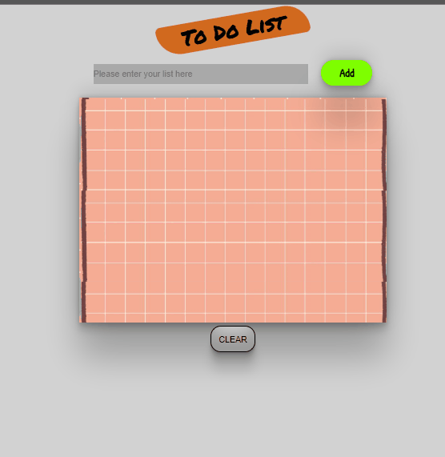

# toDoListWith_JS

# 👉 Javascript-DOM  👈

## Purposes of this project are

✔ to use <b>capturing</b> method in JS DOM,   
✔ to use <b>classList</b> property and its methods to add and remove some classes of elements.  
✔ to use <b>createElement</b> and <b>appendChild</b> methods to add new element inside of our HTML Document,  
✔ to use <b>confirm</b> property to interact with the user,  
✔ to use <b>alert</b> to send user some messages if something wents wrong,  
✔ to use <b>parentElement, firstElementChild,  previous-nextElementSibling</b> etc. to navigate between nodes,  

[Click Here](https://ridvankoseler.github.io/toDoListWith_JS/)

